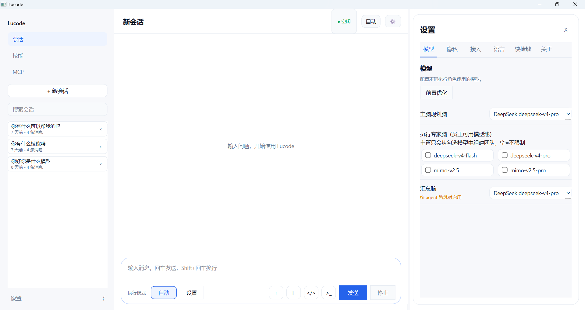
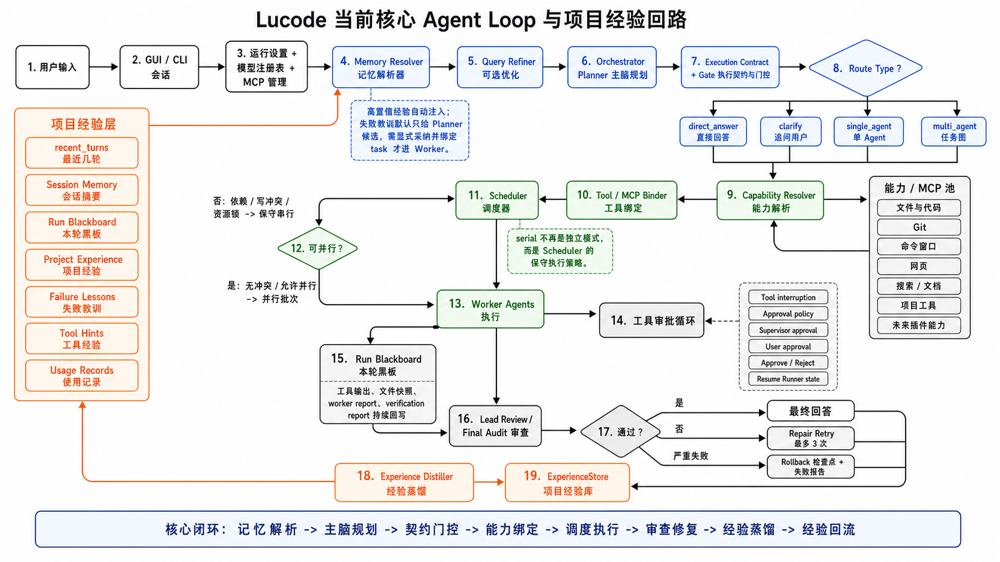

# Lucode GUI

Lucode GUI 是 Lucode 的实验版图形工作台。它把 GUI 会话、模型配置、MCP / 工具接入、工具审批、任务执行状态和项目经验回路放在同一个本地工作区里，用来探索更适合长期项目协作的 Agent Loop。

> 当前版本仍是实验版：界面、配置入口和部分 Agent 编排策略还在快速迭代中，不建议把它当成稳定发行版或生产级自动化工具。

## 界面预览

GUI 当前以“会话 + 设置面板 + 执行控制”为核心。模式入口已经收敛到 `自动`，旧的 `solo / serial / full` 不再作为 GUI 主切换项展示。



核心执行链路围绕“记忆解析 -> 主脑规划 -> 契约门控 -> 能力绑定 -> 调度执行 -> 审查修复 -> 经验蒸馏 -> 经验回流”展开。



## 这是什么

Lucode 的目标不是只做一个聊天窗口，而是做一个面向本地项目的 Agent 工作台：

- 中文优先，项目本地优先。
- 同时保留 CLI 和 GUI，两者共享运行时能力。
- 使用统一 Agent Loop 处理直接回答、单 Agent 任务和多 Agent 任务图。
- 支持模型注册表、角色模型选择、MCP 管理和工具审批。
- 通过项目经验库记录可复用的验证命令、路径映射、工具经验、项目事实和失败教训。
- 让后续任务可以从同一项目里的历史经验中获益，而不是每轮都从零开始。

## 当前可用能力

- GUI 会话：创建会话、输入任务、查看执行状态。
- 设置面板：配置模型、隐私、接入、语言、快捷键等入口。
- 统一执行模式：GUI 主入口显示为 `自动`，由运行时根据任务类型选择 direct answer、single agent 或 task graph。
- 能力绑定：根据任务需要绑定文件、代码、Git、命令、网页、搜索、MCP 等能力。
- 调度器：不再把 `serial` 当成独立用户模式，而是在有依赖、写冲突、资源锁或并行关闭时采用保守串行策略。
- 工具审批循环：对命令、文件写入、高风险工具调用等动作进行审批和恢复。
- Run Blackboard：本轮运行中持续记录工具输出、文件快照、worker report 和 verification report。
- 项目经验回路：Experience Distiller 从成功和失败运行中提炼高确定性经验，写入 ExperienceStore。

## 核心 Agent Loop

当前主流程可以概括为：

```text
用户输入
  -> GUI / CLI 会话
  -> 运行设置 + 模型注册表 + MCP 管理
  -> Memory Resolver 记忆解析器
  -> Query Refiner 可选优化
  -> Orchestrator Planner 主脑规划
  -> Execution Contract + Gate 执行契约与门控
  -> Capability Resolver 能力解析
  -> Tool / MCP Binder 工具绑定
  -> Scheduler 调度器
  -> Worker Agents 执行
  -> Tool Approval Loop 工具审批循环
  -> Run Blackboard 本轮黑板
  -> Lead Review / Final Audit 审查
  -> Experience Distiller 经验蒸馏
  -> ExperienceStore 项目经验库
  -> 回流到下一轮 Memory Resolver
```

记忆注入遵循保守策略：高置信经验可以自动进入 Planner；失败教训默认只作为 Planner 候选，必须被 Planner 显式采纳并绑定到具体 task，才会进入 Worker 上下文。

## 快速开始

需要 Python 3.11+。GUI 依赖是可选依赖，建议这样安装：

```powershell
python -m pip install -e ".[gui]"
```

在项目目录启动 GUI：

```powershell
python -m lucode.gui --workspace .
```

如果只想使用 CLI：

```powershell
python -m pip install -e .
lucode chat
```

本仓库不依赖本地批处理脚本启动。`run_gui.bat` 属于个人机器上的便捷入口，不应提交到仓库。

## 配置与隐私

Lucode 会区分用户级配置和项目级配置：

- 用户级凭据通常保存到用户目录下的 Lucode 配置位置。
- 项目级配置、会话、记忆和临时运行数据保存在当前工作区。
- 不要提交 `.env`、`.lucode/`、`.agent_cache/`、`.agent_runs/`、`.agent_quarantine/` 或任何包含 API key 的文件。

常见 Provider、模型和角色配置可以在 GUI 设置面板中调整，也可以继续通过 CLI 命令管理。

## 实验版边界

- GUI 仍在打磨中，布局、面板开关和设置入口会继续调整。
- `solo / serial / full` 仍可能存在于兼容层或旧配置中，但 GUI 主流程已经收敛到统一自动执行。
- 项目经验回路已经具备规则蒸馏、置信度、去重、使用记录和保守注入机制；真实 LLM 表达压缩与更多可视化管理入口仍属于后续增强。
- ComfyUI、内置网页、内置命令窗口和插件化能力是后续方向，不代表当前仓库已经完整内置。
- 这是本地优先的开发实验项目，不提供 npm wrapper、独立 exe 或云端托管承诺。

## 开发验证

常用检查命令：

```powershell
python -m py_compile lucode\gui\__main__.py lucode\gui\control_panel.py
python -m pytest tests\test_gui_control_panel.py tests\test_gui_layout_shell.py -q
```

推送前至少应检查 Git 状态、暂存差异和敏感信息，避免把本地配置、密钥或机器专用脚本提交到远端。

## 仓库状态

- 当前版本：`0.1.0`
- Python 要求：`>=3.11`
- GUI 依赖：`PySide6`、`qasync`
- 许可证：`UNLICENSED`
